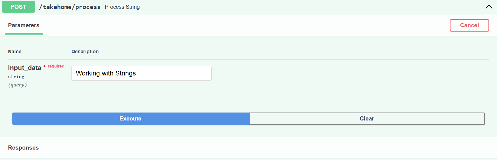
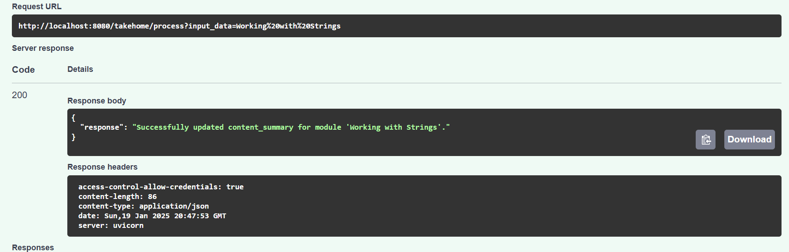
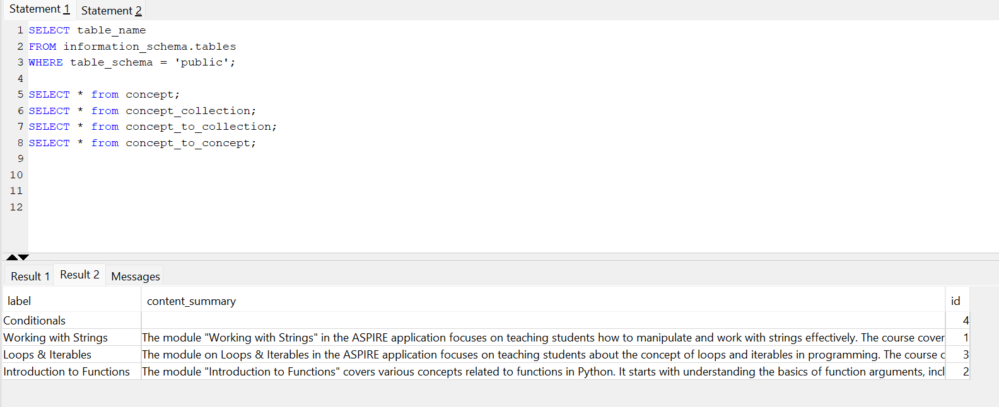

## Service Descriptions

### `data_aggregation.py`
This file contains functions to interact with the database and fetch data related to concepts and collections. The functions are:

- **`fetch_summary_by_name(connection, name)`**:
  - Fetches the summary for a given concept name from the `concept` table.
  - Uses a SQL query to retrieve the summary and handles exceptions.

- **`fetch_concepts_for_collection(connection, collection_id)`**:
  - Fetches the concepts associated with a specific collection (module) using the collection ID.
  - Uses a SQL query to retrieve the concept names and handles exceptions.

- **`fetch_prerequisites(connection, concept_name)`**:
  - Fetches the prerequisite concepts for a given concept.
  - Uses a SQL query to retrieve the prerequisite names and handles exceptions.

- **`prepare_input_for_llm(connection, label)`**:
  - Prepares input for the LLM by gathering summaries of concepts and their prerequisites.
  - Fetches the collection ID using the label, retrieves concepts for the collection, and fetches summaries and prerequisites for each concept.
  - Returns a formatted string with the gathered information.

- **`update_module_summary(connection, label, llm_response)`**:
  - Updates the `content_summary` column in the `concept_collection` table for the corresponding module (identified by label) with the LLM response.
  - Uses a SQL query to update the summary and handles exceptions.

- **`llm_input(label, connection)`**:
  - Calls `prepare_input_for_llm` to get the input for the LLM and returns it.
  - Handles exceptions and prints error messages.

### `generate_summary.py`
This file contains the logic to generate a summary for a module using an LLM. The functions are:

- **`get_llm_response(label, collection)`**:
  - Uses the `llm_input` function to prepare the input for the LLM.
  - Formats a prompt using the `PromptTemplate` from `langchain_core.prompts`.
  - Invokes the LLM with the formatted prompt and returns the response content.

### `llm_service.py`
This file contains the configuration for the LLM service. The function is:

- **`model()`**:
  - Creates and returns an instance of `ChatOpenAI` from `langchain_openai`.
  - Uses the `OPENAI_API_KEY` from the environment variables to authenticate the LLM service.

### `sql_connection.py`
This file contains the logic to establish a connection to the PostgreSQL database. The function is:

- **`make_connection()`**:
  - Connects to a PostgreSQL database using the `psycopg2` library.
  - Uses the `DATABASE1_URL` from the environment variables to establish the connection.
  - Returns the connection object and handles exceptions.

### `update_summary.py`
This file contains the logic to update the summary of a module. The function is:

- **`update_summary(label)`**:
  - Establishes a connection to the database using `make_connection`.
  - Calls `get_llm_response` to generate a summary for the module.
  - Calls `update_module_summary` to update the `content_summary` column in the `concept_collection` table with the generated summary.
  - Closes the database connection and returns the result.

# API Endpoint Documentation

## Image 1: Endpoint Created to Post

## Image 2: Endpoint Showing Data Inserted Correctly

## Image 3: Data in the Database

